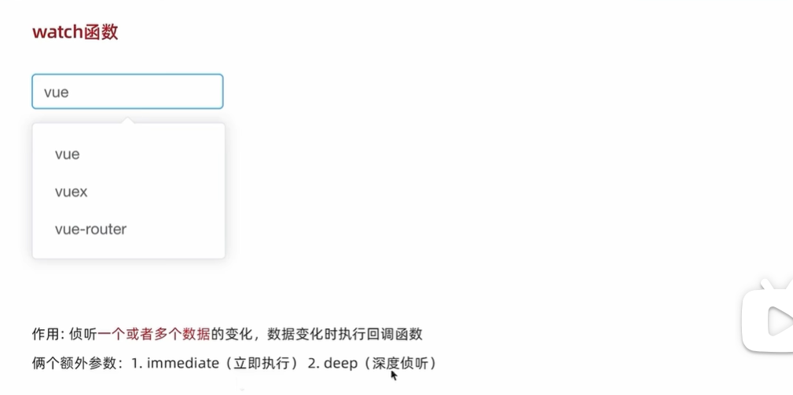
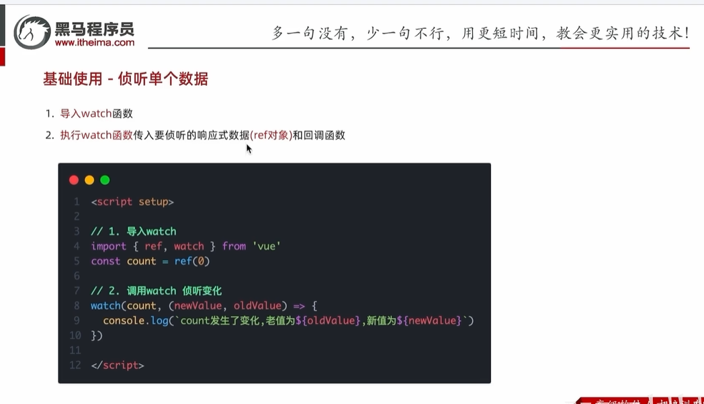
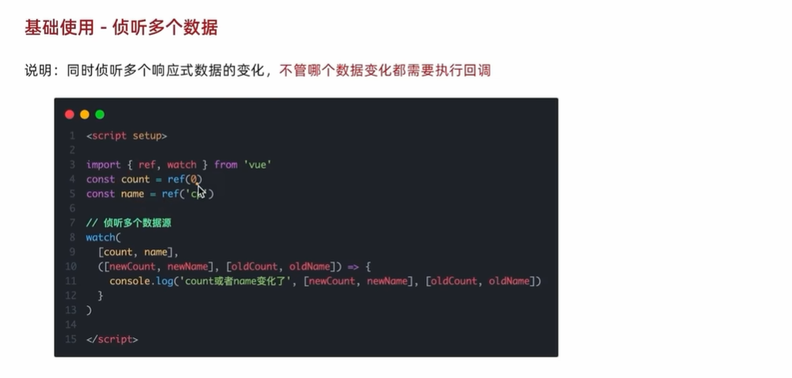
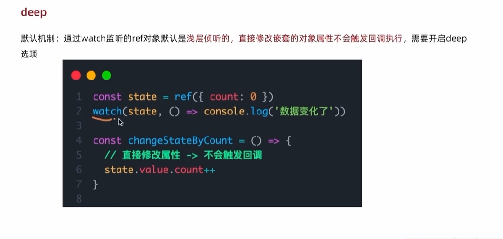
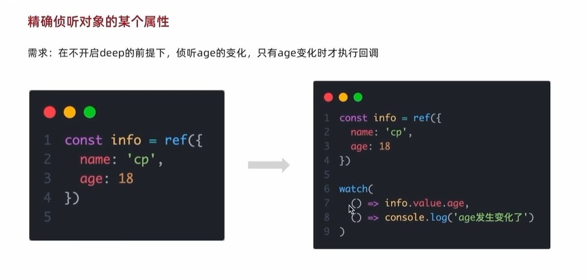

# watch函数——侦听数据变化

作用：侦听一个或者多个数据的变化，数据变化时执行回调函数。

额外参数：immediate（立即执行），deep(深度侦听)

##### 一、侦听单个数据

watch函数的两个参数：

count:侦听对象，如图所示ref(0)即生成了一个响应数据；

(newValue, oldValue):回调函数，即当侦听的count发生变化时，这个回调函数就会不断地执行，其中newValue表示变化之后的新值

##### 二、侦听多个数据

> [!IMPORTANT]
>
> 侦听的参数变成一个数组[count, name]，同样的第二个参数就是回调函数，多组值对应的是前面的各个响应值。其中不管侦听的哪个变化，都会执行回调函数。

##### 三、额外参数

（一）immediate参数

例子如图左边所示，可以实现用户一点击输入框，即可以弹出下方内容

（二）deep参数

> [!WARNING]
>
> deep参数会造成性能损耗，实际中尽量少用。

（三）精准侦听对象的某个属性

即将watch函数变成两个回调函数的形式，第一个回调函数里return出来要侦听的属性，第二个回调函数则是数据变化时执行的动作即可。

#### 章节小结
