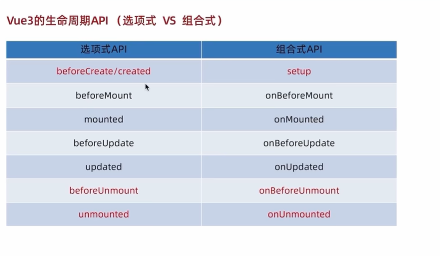
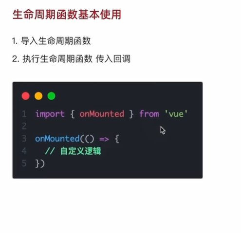
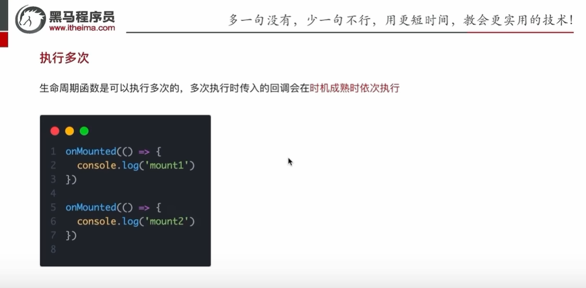
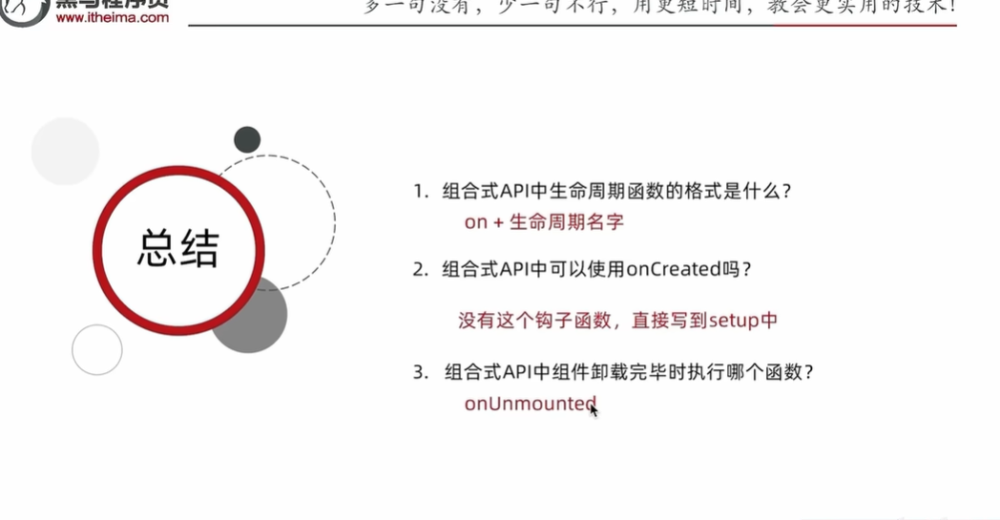

# 组合API-生命周期函数

##### 一、生命周期函数的基本使用

##### 二、多次执行

> [!NOTE]
>
> 该用法使用场景：当你不好修改原有onMounted函数逻辑时，但又迫于加入自己的使用逻辑，则可以直接添加一个onMounted函数，反正它可以依次执行不干扰

> [!CAUTION]
>
> PS:这里只学习和举例了onMounted函数，其他的API生命周期函数与其用法相似。

##### 三、章节小结

