# 项目起步

##### 一、创建项目并精细化配置

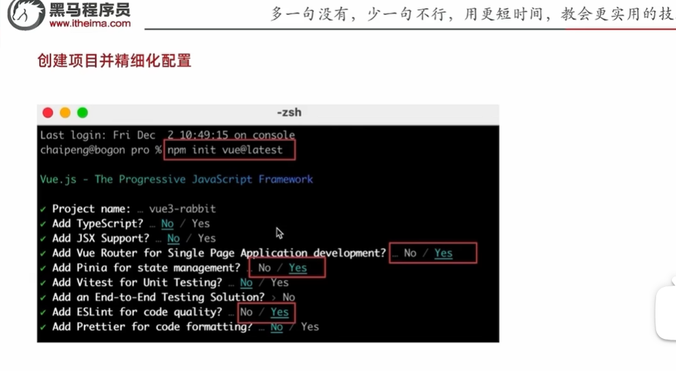

##### 二、src目录调整

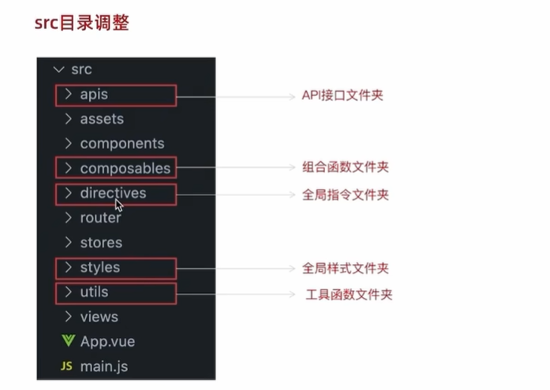

##### 三、git项目管理

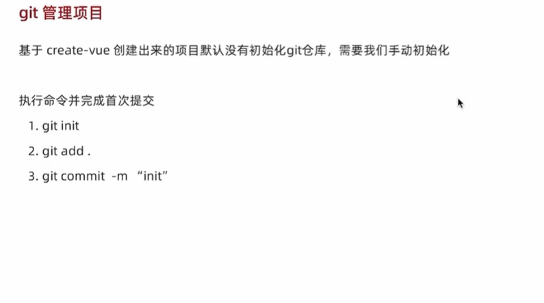

##### 三、别名路径的联想提示

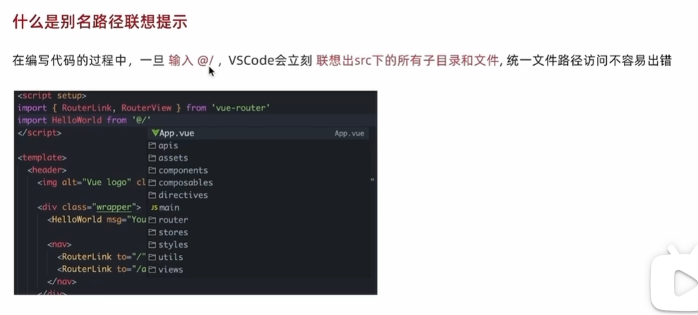

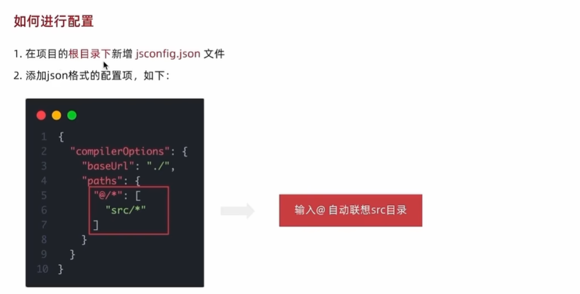

> [!IMPORTANT]
>
> PS:此处的配置就只是路径提示，在vite.config.js中做的才是实际的路径转换

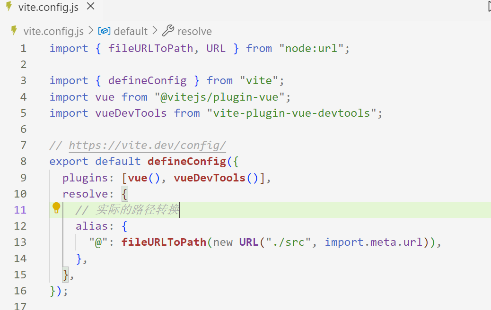

##### 四、elementPlus引入——解决通用型组件

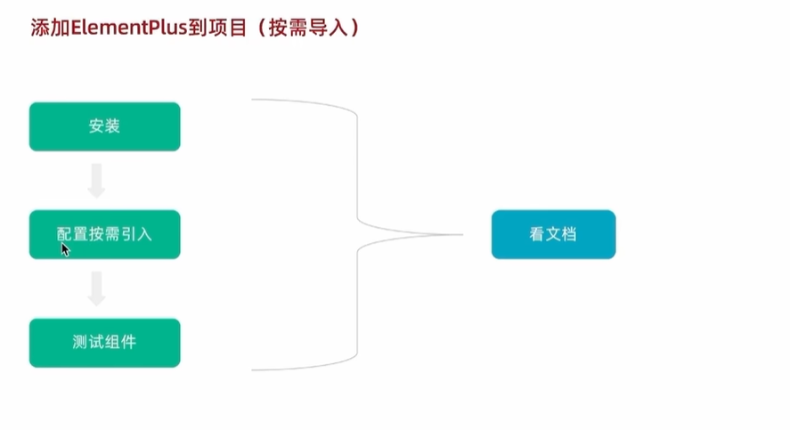

PS：此处为官网文件（element plus）

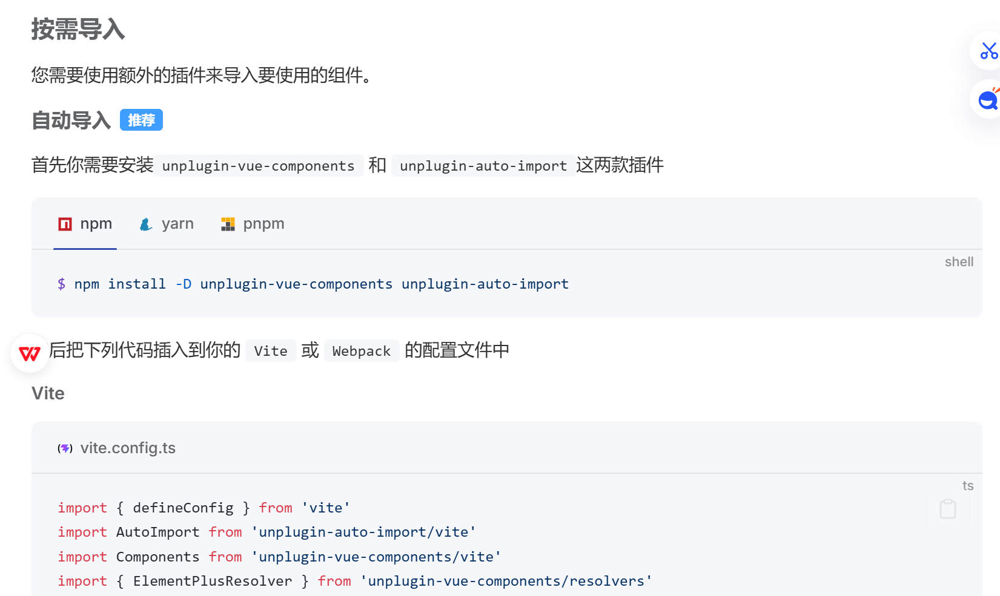

1、安装element plus主包

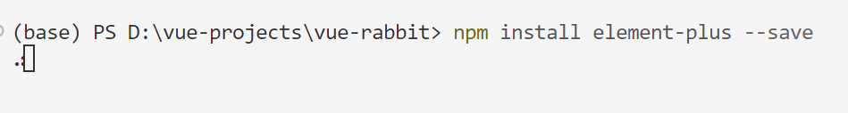

2、安装前边“按需导入”的插件

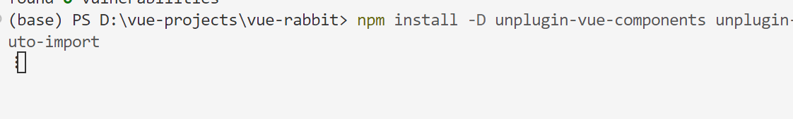

3、配置插件(根据官方文档提示)

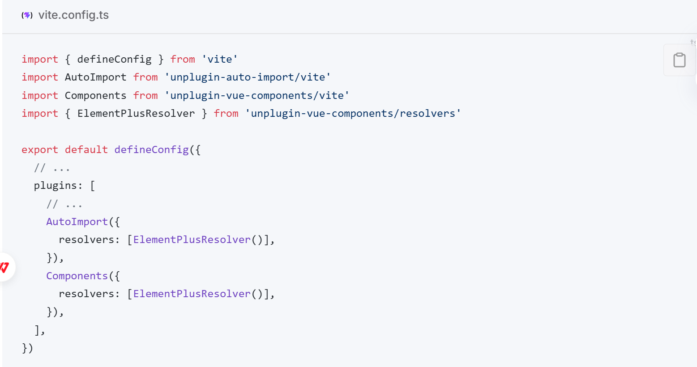

##### 五、elementPlus主题定制

1、该实例项目中定制主题的原因

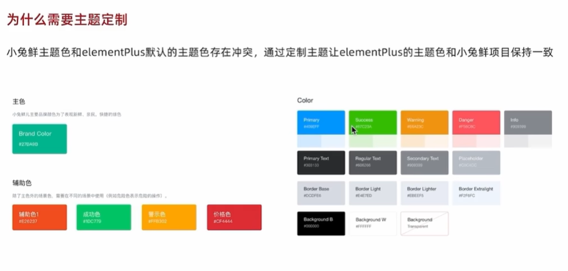

2、如何定制主题

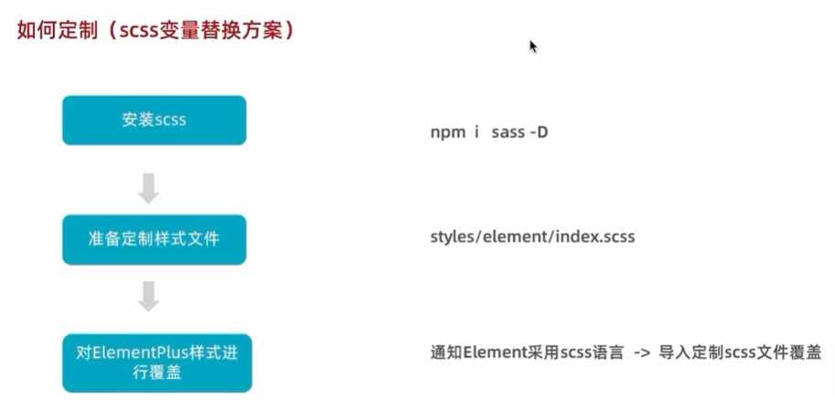

###### 六、axios基础配置

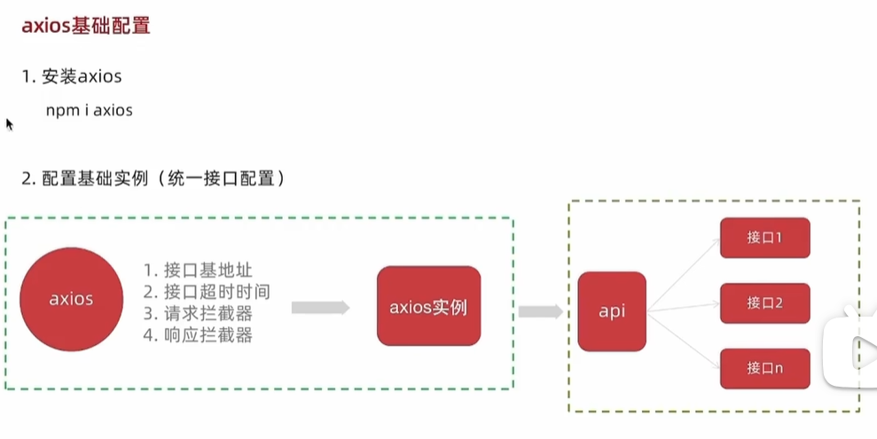

##### 七、项目整体路由设计